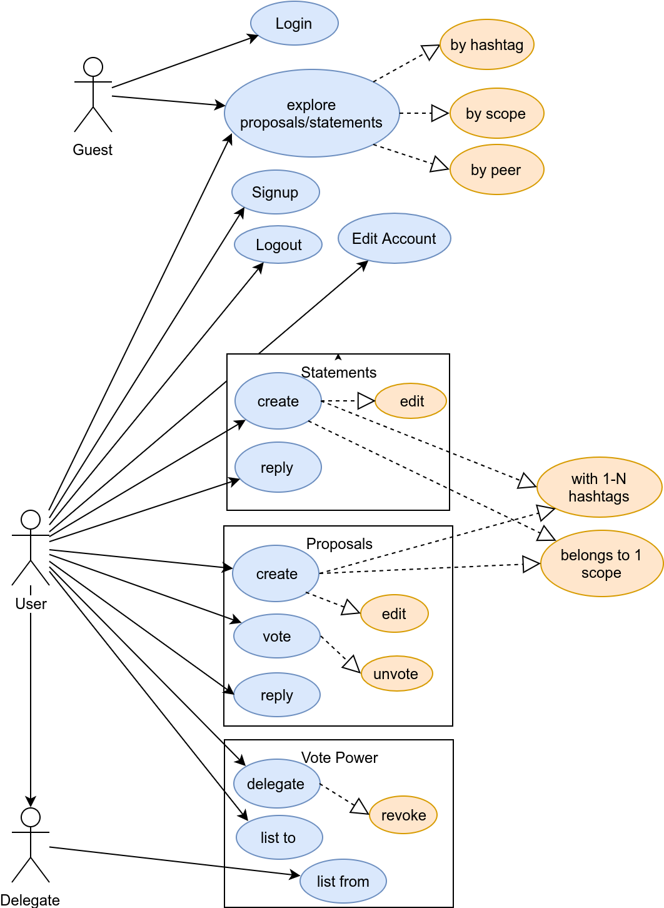
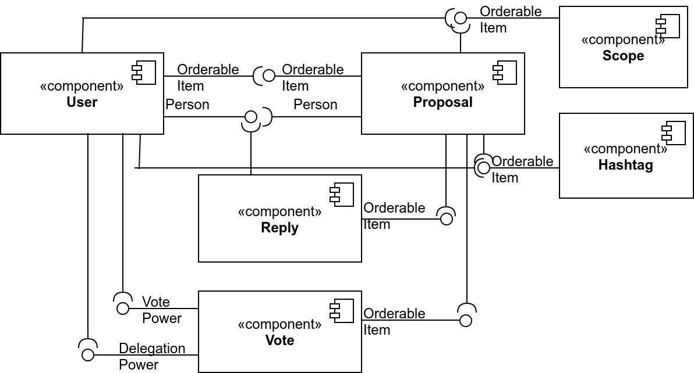
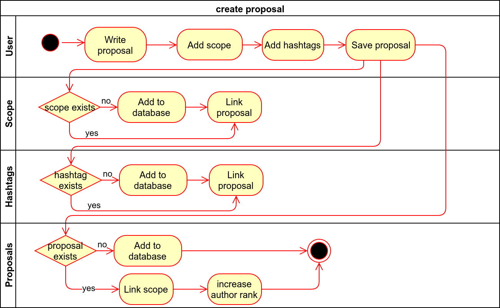
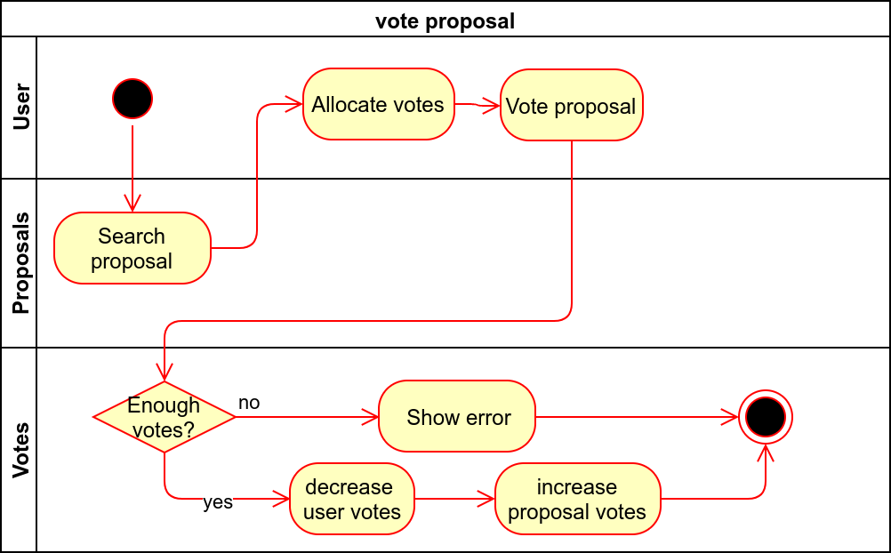
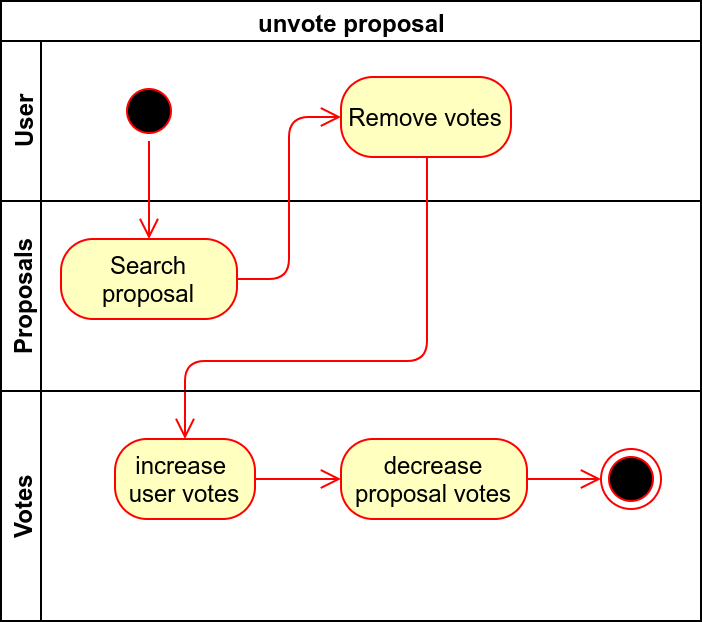
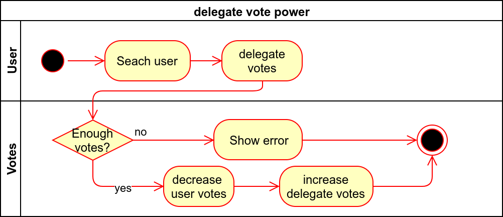
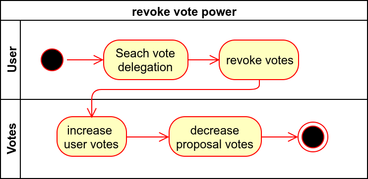

# Sovereign Software Architecture

An uml approach to explain liquid democracy software.

### Table of Diagrams

- [1. User Story](#1-user-story)
- [2. Use Case](#2-use-case)
- [3. Component](#3-component)
- [4. Activity](#4-activity)
  * [4.1 Proposals](#41-proposals)
  * [4.2 Vote Power](#42-vote-power)

## 1. User Story

### 1.1 Basic
| ID# | User Story                                                                          | 
|------|-------------------------------------------------------------------------------------| 
| 1    | As a guest or user, I want to explore proposals/statements                          | 
| 2    | As a guest or user, I want to see the proposals/statements made by an specific user | 
| 3    | As a guest or user, I want to search proposals/statements by hashtags(#)            | 
| 4    | As a guest or user, I want to search proposals/statements by scope(~)               | 

### 1.2 Account and Profile
| ID# | User Story                                                                                                                              | 
|------|-----------------------------------------------------------------------------------------------------------------------------------------| 
| 5    | As a guest, I want to signup into the app using an email, name and password                                                             | 
| 6    | As a user, I want to change my nationality (tribe), my digital id (digital name), my real name (first name and surname) and add a photo | 
| 7    | As a user, I want to be able to log out of the app.                                                                                     | 

### 1.3 Proposals
| ID# | User Story                                                                                         | 
|------|----------------------------------------------------------------------------------------------------| 
| 8    | As a user, I want to create a proposal/statement and see it in the main feed                       | 
| 9    | As a user, I want to update/edit/delete my proposals/statements before they recibe a reply or vote | 
| 10   | As a user, I want to reply to other users proposals/statements                                     | 

### 1.4 Votes
| ID# | User Story                                                             | 
|------|------------------------------------------------------------------------| 
| 11   | As a user, I want to vote on proposals/statements                      | 
| 12   | As a user, I want to unvote proposals                                  | 
| 13   | As a user, I want to delegate vote power to other user                 | 
| 14   | As a user, I want to revoke vote power from other user                 | 
| 15   | As a user, I want to see the list of people I delegate votes to        | 
| 16   | As a user, I want to see the list of people that delegates votes to me | 

### 1.5 Scopes
| ID# | User Story                                                  | 
|------|-------------------------------------------------------------| 
| 17   | As a user, I can create a scope type                        | 
| 18   | As a user, I can create a scope and link it to a scope type | 
| 19   | As a user, I want to be able to join and leave a scope      | 

### Glosary
| Term           | Meaning                                                                                                                                      | 
|----------------|----------------------------------------------------------------------------------------------------------------------------------------------| 
| guest          | a person who uses or operates the app in anonymous mode                                                                                      | 
| user           | a person who uses or operates the app and has been registered                                                                                | 
| delegate       | a user who receives token votes from other user                                                                                              | 
| statement      | a text that describe an opinion or an idea, it is not votable, it can contain hashtags                                                       | 
| proposal       | a text that describe an idea or makes a statement that is votable, it can contain hashtags                                                   | 
| hashtag        | short identifier of kind of content in the proposal, could be more than one, starts with hashtag (# character)                               | 
| proposal scope | short identifier to assign a proposal or set of proposals to a region, group or entity. Only one scope per proposal. Starts with ~ character | 
| $vote (noun)   | a token used to signal choices and that can be allocated on proposals and transfered to a user that become a delegate                        | 
| vote (verb)    | when a user chooses to allocate a number of tokens to a choice on a determinated proposal                                                    | 
| unvote         | when a user chooses to withdraw its token on a proposal                                                                                      | 
| delegation     | when a user chooses to send tokens to a another user which becomes a delegate                                                                | 
| revoke         | when a user chooses to retrieve the tokens he previously sent to its delegate                                                                | 
## 2. Use Case

## 3. Component

## 4. Activity

### 4.1 Proposals

#### Create Proposal

#### Vote Proposal

#### Unvote Proposal

### 4.2 Vote Power

#### Delegate

#### Revoke

